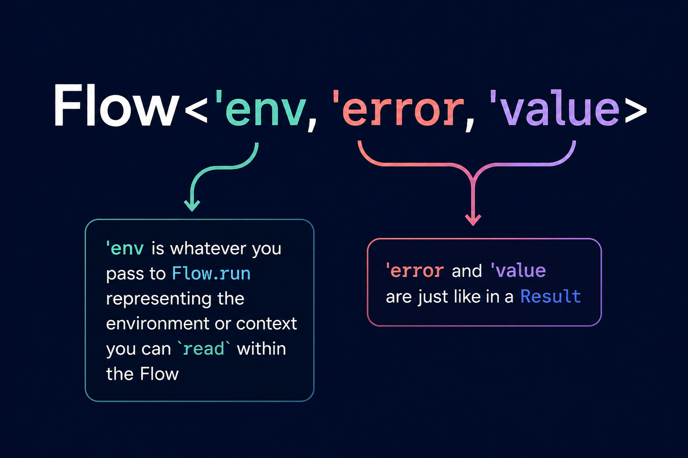

<div class="docs-home-hero">

<div class="docs-home-copy">

<span class="eyebrow">One model from predicate checks to task execution</span>

# A single model for Result-based programs in F#.

<p class="lede">
Write predicate checks once. Keep fail-fast logic in `Result`, accumulate sibling failures with `Validation`, then lift the same logic into `Flow`, `AsyncFlow`, or `TaskFlow` when the boundary needs environment access, async work, task interop, cancellation, or runtime policy.

</p>

<div class="docs-home-meta">
<span class="docs-chip">Check -> Result -> Validation</span>
<span class="docs-chip">Flow / AsyncFlow / TaskFlow</span>
<span class="docs-chip">Typed failure</span>
<span class="docs-chip">Explicit environment</span>
<span class="docs-chip">Runtime context</span>
<span class="docs-chip">Cold execution semantics</span>
</div>

</div>

:::warning
API Still stabilising - wait for 1.0 to avoid breaking changes
:::

<aside class="docs-home-panel">
<section class="docs-home-panel-card">
<span class="label"><a href="./reference/fsflow/validation">Check First</a></span>
<strong>Start with `Check` and `Result`, then lift the same logic directly into flows with `let!` and `do!`.</strong>
</section>

<section class="docs-home-panel-card">
<span class="label">Short-Circuiting Workflows</span>
<strong>`Flow`, `AsyncFlow`, and `TaskFlow` are ordered, typed-failure orchestration tools. Use `Validation` and `validate {}` when you need accumulated sibling errors.</strong>
</section>
</aside>

</div>

## Core Progression

```text
Check -> Result -> Validation -> Flow -> AsyncFlow -> TaskFlow
```

The vocabulary stays stable while the execution context grows.

- `Check` gives you reusable pure predicates.
- `Result` keeps fail-fast domain and application failures typed.
- `Validation` accumulates sibling failures in a structured graph.
- `Flow` adds explicit environment access for synchronous orchestration.
- `AsyncFlow` and `TaskFlow` keep the same style when the boundary becomes asynchronous.

## Example: check once, lift later

```fsharp
open FsFlow

type RegistrationError =
    | EmailMissing
    | SaveFailed of string

let validateEmail (email: string) : Result<string, RegistrationError> =
    email
    |> Check.notBlank
    |> Result.mapErrorTo EmailMissing
```

That pure `Result` can be used directly in a task-oriented application boundary:

```fsharp
open System
open System.IO
open System.Threading
open System.Threading.Tasks
open FsFlow

type User =
    { Email: string
      SettingsPath: string
      FeatureFlagsPath: string }

type RegistrationEnv =
    { Root: string
      LoadUser: int -> Task<Result<User, RegistrationError>>
      SaveUser: User -> Task<Result<unit, RegistrationError>> }

let readTextFile (path: string) : TaskFlow<RegistrationEnv, RegistrationError, string> =
    taskFlow {
        do! Check.okIf (File.Exists path)
            |> Result.mapErrorTo (SaveFailed $"Missing file: {path}")

        return! ColdTask(fun ct -> File.ReadAllTextAsync(path, ct))
    }

let registerUser userId : TaskFlow<RegistrationEnv, RegistrationError, string * string> =
    taskFlow {
        let! root = TaskFlow.read _.Root
        let! loadUser = TaskFlow.read _.LoadUser
        let! saveUser = TaskFlow.read _.SaveUser

        let! user = loadUser userId
        do! validateEmail user.Email

        let settingsFile = Path.Combine(root, user.SettingsPath)
        let featureFlagsFile = Path.Combine(root, user.FeatureFlagsPath)

        let! settings = readTextFile settingsFile
        let! featureFlags = readTextFile featureFlagsFile
        do! saveUser user

        return settings, featureFlags
    }
```

`validateEmail` is just `Result<string, RegistrationError>`.
`taskFlow` lifts it directly with `do!`.
The runtime gets richer without changing how validation is expressed.

This snippet shows the core shape. The full runnable example, including `main` and temp-directory setup,
is in [`examples/FsFlow.ReadmeExample/Program.fs`](https://github.com/adz/FsFlow/blob/main/examples/FsFlow.ReadmeExample/Program.fs).

It reads `Root` and other dependencies from `'env`, reuses plain validation, and performs file reads in one `taskFlow {}`
so the cancellation token is passed implicitly into each cold task.

Run side:

```fsharp
use cts = new CancellationTokenSource()

registerUser 42
|> TaskFlow.run
    { Root = root
      LoadUser = fun _ -> Task.FromResult (Error EmailMissing)
      SaveUser = fun _ -> Task.FromResult (Ok ()) }
    cts.Token
|> Async.AwaitTask
|> Async.RunSynchronously
```

## Start

<div class="docs-grid">

<section class="docs-card">
<span class="label">Start</span>
<h2><a href="index">Home</a></h2>
<p>The landing page and a short orientation to the docs site.</p>
</section>

<section class="docs-card">
<span class="label">Start</span>
<h2><a href="GETTING_STARTED">Getting Started</a></h2>
<p>The fastest path from `Check` and `Result` code to the right FsFlow family for a real application boundary.</p>
</section>

<section class="docs-card">
<span class="label">Start</span>
<h2><a href="VALIDATE_AND_RESULT">Validate and Result</a></h2>
<p>The central validation story: use `Check`, `Result`, and `Validation` before you lift into flows.</p>
</section>

<section class="docs-card">
<span class="label">Start</span>
<h2><a href="TINY_EXAMPLES">Common Shapes</a></h2>
<p>Small examples for `flow {}`, `asyncFlow {}`, `taskFlow {}`, and `ColdTask` composition patterns.</p>
</section>

</div>

## Core Model

<div class="docs-grid">

<section class="docs-card">
<span class="label">Core Model</span>
<h2><a href="WHY_FSFLOW">The FsFlow Model</a></h2>
<p>Why FsFlow is best understood as one scalable model from `Check` through `TaskFlow`, not a bag of boundary helpers.</p>
</section>

<section class="docs-card">
<span class="label">Core Model</span>
<h2><a href="SEMANTICS">Execution Semantics</a></h2>
<p>Cold execution, rerun behavior, exception handling, cancellation propagation, and runtime context.</p>
</section>

<section class="docs-card">
<span class="label">Core Model</span>
<h2><a href="TASK_ASYNC_INTEROP">Task and Async Interop</a></h2>
<p>Direct binding rules for `Async`, `Task`, `ValueTask`, `Result`, `Validation`, and `ColdTask` across the workflow families.</p>
</section>

<section class="docs-card">
<span class="label">Core Model</span>
<h2><a href="ENV_SLICING">Environment Slicing</a></h2>
<p>How to keep each flow honest about the smallest environment or capability set it actually needs.</p>
</section>

<section class="docs-card">
<span class="label">Core Model</span>
<h2><a href="ARCHITECTURAL_STYLES">Architectural Styles</a></h2>
<p>The three supported application shapes and how the runtime/capability model fits into them.</p>
</section>

</div>

## Patterns

<div class="docs-grid">

<section class="docs-card">
<span class="label">Patterns</span>
<h2><a href="examples/README">Runnable Examples</a></h2>
<p>Executable examples that mirror the docs build and show real application-shaped flows.</p>
</section>

<section class="docs-card">
<span class="label">Patterns</span>
<h2><a href="TROUBLESHOOTING_TYPES">Troubleshooting Types</a></h2>
<p>The compiler errors that usually mean a wrapper boundary or computation family was chosen incorrectly.</p>
</section>

<section class="docs-card">
<span class="label">Patterns</span>
<h2><a href="BENCHMARKS">Benchmarks</a></h2>
<p>The measured overhead of FsFlow compared to manual result, async, and task composition.</p>
</section>

</div>

## Ecosystem

<div class="docs-grid">

<section class="docs-card">
<span class="label">Ecosystem</span>
<h2><a href="INTEGRATIONS_FSTOOLKIT">Replacing FsToolkit.ErrorHandling</a></h2>
<p>How FsFlow replaces the common Result plus AsyncResult plus TaskResult workflow path.</p>
</section>

<section class="docs-card">
<span class="label">Ecosystem</span>
<h2><a href="INTEGRATIONS_VALIDUS">Validus Integration</a></h2>
<p>When validation should stay outside FsFlow because the problem is richer or accumulated.</p>
</section>

<section class="docs-card">
<span class="label">Ecosystem</span>
<h2><a href="INTEGRATIONS_ICEDTASKS">IcedTasks Integration</a></h2>
<p>Task-native ergonomics and cold-task helpers alongside typed failure and explicit environments.</p>
</section>

<section class="docs-card">
<span class="label">Ecosystem</span>
<h2><a href="INTEGRATIONS_FSHARPPLUS">FSharpPlus Integration</a></h2>
<p>Broad functional helpers that can stay separate from the FsFlow boundary model.</p>
</section>

<section class="docs-card">
<span class="label">Ecosystem</span>
<h2><a href="EFFECT_TS_COMPARISON">Effect-TS Comparison</a></h2>
<p>What overlaps with Effect-TS and what FsFlow keeps intentionally smaller.</p>
</section>

<section class="docs-card">
<span class="label">Ecosystem</span>
<h2><a href="INTEGRATIONS">Ecosystem Overview</a></h2>
<p>The broader map of where FsFlow fits beside other libraries once the core path is clear.</p>
</section>

</div>

## Reference

<div class="docs-grid">

<section class="docs-card">
<span class="label">Reference</span>
<h2><a href="./reference/fsflow/">API Reference</a></h2>
<p>The API landing page for the main `FsFlow` package and its task surface.</p>
</section>

<section class="docs-card">
<span class="label">Reference</span>
<h2><a href="./reference/fsflow/">FsFlow</a></h2>
<p>The main package hub, including `Check`, `Result`, `Validation`, `Flow`, `AsyncFlow`, `TaskFlow`, `ColdTask`, and support types.</p>
</section>

</div>
